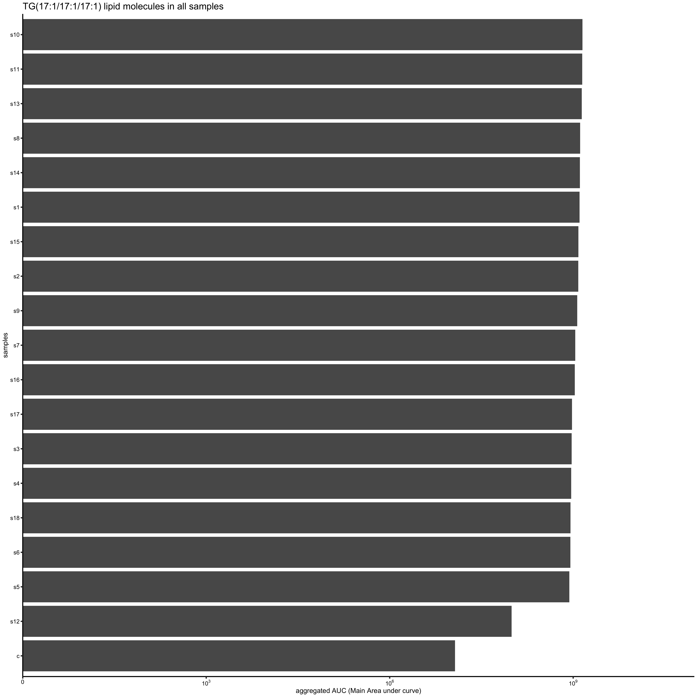
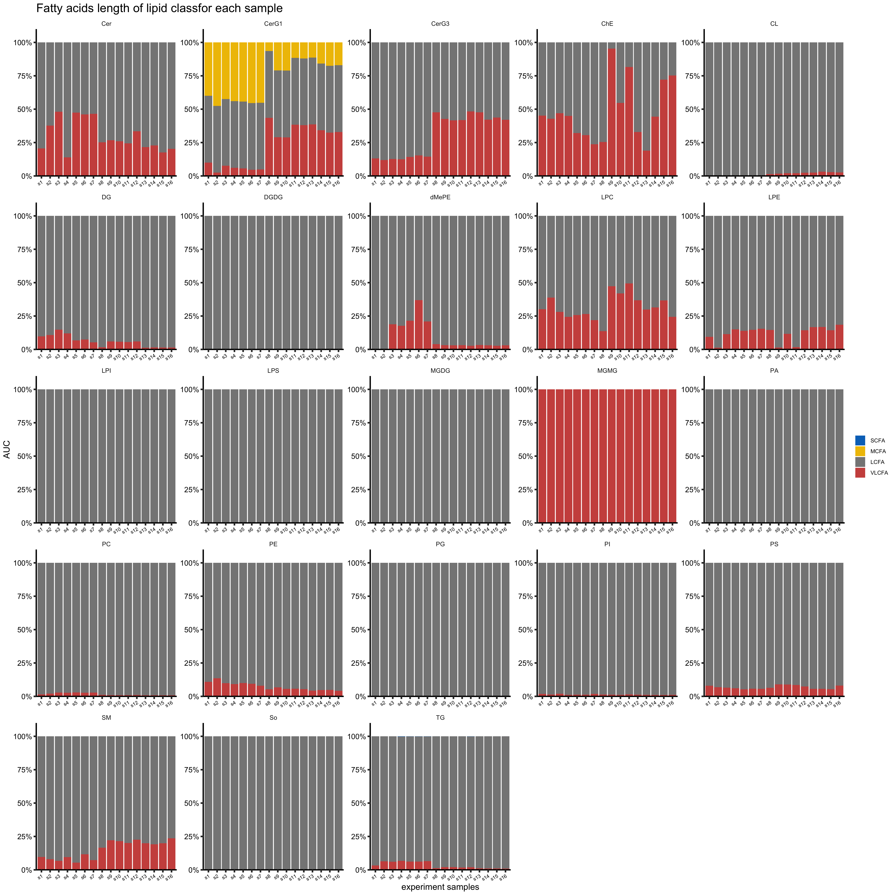
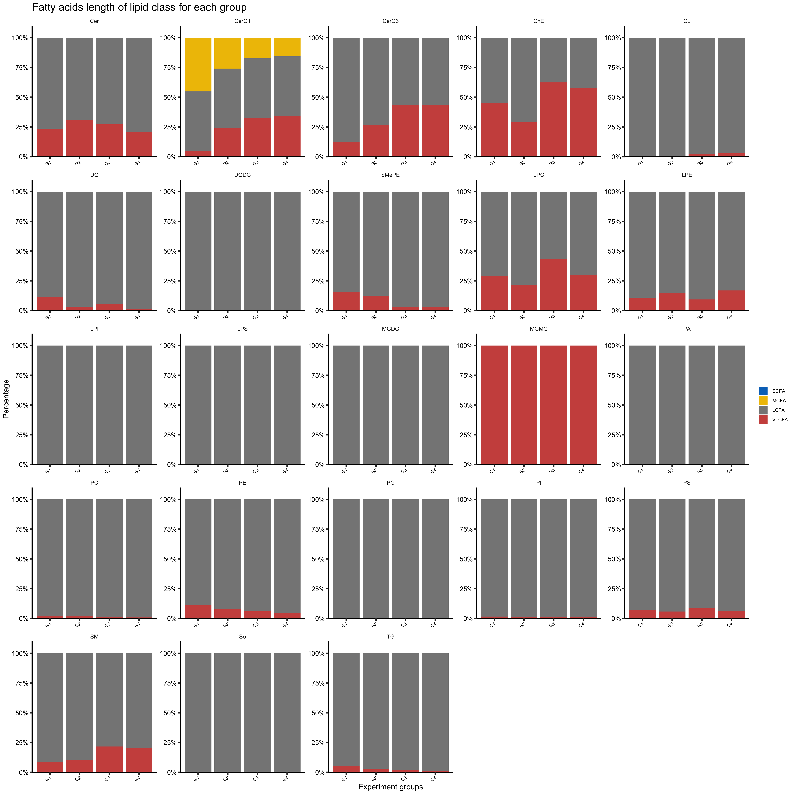
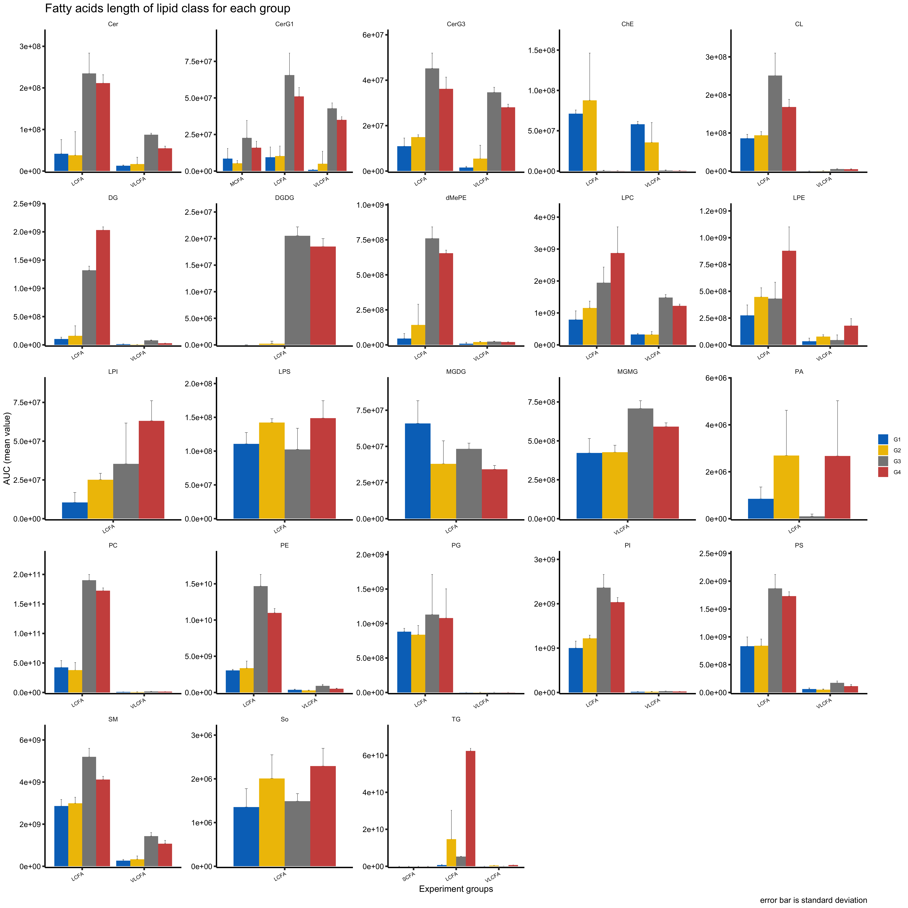
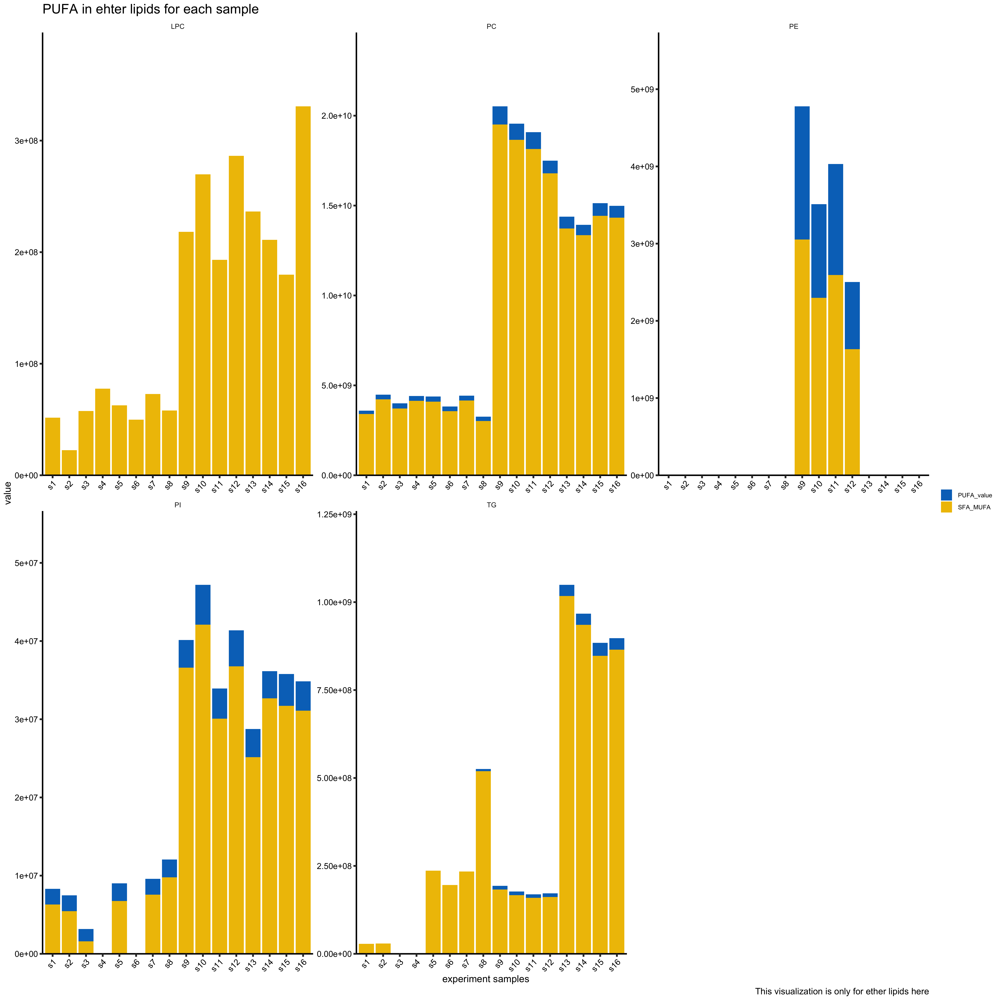

Manual of Lipidomics Pipeline
================
Wenting
2/21/2020


### Introduction

The Farese and Walther lab at the Harvard T.H. Chan School of Public
Health have used LipidSearch software (version 4.1) for some time. We
have established a pipeline based on Mass Spectrometry data processed by
this software. Data origniated from txt file will be processed
appropriate quality control and quality assurance with flexible
standards, applied with statistics analysis and visualization.

### Set up

  - Required R version 3.6.0 or later is required.  
  - For Windows users, please make sure your Rstudio has authority to
    install packages.
  - For Mac users, XQaurtz and gfortran need to be installed manually.  
  - Any additional packages/libraries will be installed and uploaded
    automatically.
  - Pipeline will store all the output under some automatically
    generated directories, converted, data, plot, and other
    subdirectories under data and plot.  
  - To begin, please create R project via Rstudio and put all the scripts you download in the same directory.
   

Suggested using homebrew for installing XQaurtz and gfortran.

  - Open terminal on Mac, and paste the command below.  
  - Installing homebrew:  
    `/bin/bash -c "$(curl -fsSL
    https://raw.githubusercontent.com/Homebrew/install/master/install.sh)"`  
  - Installing XQaurtz:
      - `ruby -e "$(curl -fsSL
        https://raw.githubusercontent.com/Homebrew/install/master/install)"
        < /dev/null 2> /dev/null ; brew install
        caskroom/cask/brew-cask 2> /dev/null`  
      - `brew cask install xquartz`  
  - Installing gfortran: `brew install gcc`

### Overflow


### Each Step Details

- The pipeline will generate 2 folders: `plot` and `data`. Under each
folder, there will be corresponding subfolders, including `QC`,
`Quantification`, `Saturation`, `Length`, `Ether`, `Volc`.  
- Please note that, for plot display, the data are collected from
different experiments.  
- User can also freely apply data in the fold `data` to different plots.  
- The standard input are case insensitive except lipid classes, group
names, color themes.  
- Mac user must install Quartz and gfortran manually before running the
pipeline.

#### Initialization:

  - Overview: Convert txt file to csv file for consistent analysis and
    run main script FWL\_lipidomics\_Version.R  
  - To run the pipeline:
      - First, please download all the scripts in same directory with R
        project you create.  
    
      - Second, after clicking R project, run script
        **txt\_to\_csv\_version.R** to convert raw txt file by typing
        *`source`* button, or typing command
        *`source("txt_to_csv_version.R")`* in the console. User could
        also go to script and run the command line by line. User will need to choose the txt file generated from LipidSearch 4.1 for convertion. Please note
        that, the converted csv files are stored in directory
        `converted`. The rest analysis will choose one of the csv files from converted directory. 
    
      - Third, please go to the main script
        **FWL\_lipidomics\_version.R**. Press the *`source`* button, or
        type *`source("FWL_lipidomics_VERSION.R")`* in console, or you
        can run the script line by line.  
    
      - Forth, Mac user need to install gfortran and XQuartz manually
        ahead.
        
      - Fifth, user could choose png or pdf formats for plots, and corresponding svg format will be stored as well.
        
        Suggesting using homebrew for installing gfortran and XQuartz.
        Please open your terminal, and paste the code below:
        
          - for homebrew installing:  
            `/bin/bash -c "$(curl -fsSL
            https://raw.githubusercontent.com/Homebrew/install/master/install.sh)"`
          - for XQaurtz installing:
              - `ruby -e "$(curl -fsSL
                https://raw.githubusercontent.com/Homebrew/install/master/install)"
                < /dev/null 2> /dev/null ; brew install
                caskroom/cask/brew-cask 2> /dev/null`
              - `brew cask install xquartz` -for gfortran installing:
                `brew install gcc`

<!-- end list -->

``` r
# commands
source("txt_to_csv_version.R")

source("FWL_lipidomics_version.R")
```

``` 

Are you using PC or MAC?
Please type PC/MAC: MAC

Please make sure you installed Quartz and gfortran before running pipeline.
          
Do you want to continue?
Please type Y/N: y
```

``` 

What type of images you want to save? PNG or PDF?
        
Please type PNG/PDF: 
```

  - Useful short cuts: `cmd (ctr) + Enter` (run selected command), `cmd
    (ctr) + shift + c` (comment/uncomment).

#### Preprocess and Quality Check:

**(1) Read data**

  - Overview: Console will list the files in the converted directory and
    with a command line, will direct user to input the index number of
    the file for analysis. <!-- - Code display: -->

  - Utility: Please input a number of file index. After typing the
    index, console will display the file you choose.  

  - Example display:

<!-- end list -->

    The following files had been generated. 
    Select ONE for subsequent the list of file names:
    1 030420_cGSL_mouse-brains_publication.csv
    2 10252019_PGRN_ctl-het-ko.csv
    3 190911_IDX_WH_pB_Job1702_pos_MC_01.raw.csv
    4 20171127_AH_MEFpilot.csv
    5 20171127_JC_Seipin.csv
    6 20180823_LB_FIT2.csv
    7 20190130_Aditi_DGATGPAT.csv
    8 20191220_CJ_s2.csv
    9 20200210_JSCJ_s2.csv
    10 20200317_CJ_s2.csv
    11 20200317_CJ.csv
    12 Basti's work.csv
    13 BRAIIIN_single.csv
    14 cells_single.csv
    15 col_test.csv
    16 FGL_Ld_Lipidomics_0525.csv
    17 RNF213_LB_07292019.csv
    
    Please input the index number of the file: 8

    [1] "[1] converted/20171127_JC_Seipin.csv"

**(2) Check experiment samples**

  - Outline: Check for experiment samples to be excluded for analysis.  
    <!-- - Code Display: -->

  - Unitility: Please input Y or N (case insensitive).  

  - Example disdplay:
    
      - When “N” is typed, no samples are deleted for analysis.  
      - When “Y” is typed, console will direct user to input the sample
        name. Please note that the sample name has fixed format; sample
        1 would be s1 or S1. Samples are separated by space.  
      - If your data are merged, we strongly suggest deleting other
        experiment samples from your data. Otherwise, data filtering
        standard will be influenced by other samples. 
      - Small trick, if you accidently type "Y", you could input some sample which don't exist.

<!-- end list -->

``` 

Do you have samples excluded for analysis which including experiment controls (internal standards)?


Please type Y/N: Y

Indicate which samples used as controls or will be deleted for analysis
Sample ID , eg. s22 s23

option standards -----> s17 s18
```

#### **Quality Check**

Related data and plots will be under `QC` subfolders of `plot` and
`data`.

**(1) Set filter parameters**

  - Outline: Filter the data based on user’s choice. Set flexible
    parameter k and j which dipends on the experiment for total number
    of Grade A and B and APvalue.  
    Please note that Filter standard Rej = 0 will be automatically be
    applied. <!-- - Code display:  -->

  - Utility: Please input two corresponding numbers.  

  - Example display:

<!-- end list -->

``` 

Data are filtered using 3 criteria.  

 1. Not rejected by LipidSearch (Rej n=0); 
        
 2. minimum number of Grade A+B required; 
        
 3. minimum number significant identification (p-value p<=0.001) for LipidSearch standard.
        
 Filtered data is stored in the filtered.raw.data.csv.

Minimum number of identified molecules (Grade A+B) required in all samples, n>=3:

Minumum number of significantly identified lipids p<=0.001 in all samples, n>=3: 
```

**(2) Fix duplicated lipid molecules**

  - Outline: Pipeline will dectect the same lipid molecules with
    different retention time. It will filter the duplicates based on 2
    criteria. User will need to input criteria A or B (case
    insensitive). Duplicated lipid molecules will be under
    `duplicated.molecules.csv` and `diff_RT.csv`, reserved lipid
    molecules will be under `reserved_duplicates.csv`, and filtered data
    will be stored under `rm_duplicates.csv`.
      - Criteria A: use only ONE lipid molecule of each lipid class with
        largest AUC (Main Area Under Curve).  
      - Criteria B: Sum AUC for all duplicates in same lipid class.  
        `Please note that, method B will produce NA in some columns
        since the values can't be aggregated.`
  - Example display ( when identical lipid molecules exist)

<!-- end list -->

``` 

!!!Attention: Identical lipid molecules with multiples retention time. Please note that the duplicate lipid molecules are stored in reserved_duplicates.csv 
 !!!!!! Potential sample contamination. 
 To PROCEED, pick one: 

Differences in retention time for identical lipid molecule are stored under diff_RT.csv

 A: Use only ONE lipid molecule with largest main area under curve, OR 
 B: Summation of main area under curve of ALL identical lipid molecule.

Filtered lipid molecules sans duplicates are stored under removeduplicates.csv
Enter 'A' or 'B': A
Filterted lipid molecules sans duplicates are stored under removeduplicates.csv
```

**(3) Check background information**

  - Overview: Plot the back ground information (blank sample) abundance
    in each detected lipid class. The plot will be saved as
    `background.png` in `plot` directory.

  - Output example: please see figure 1.

**(4) Lipid Class Summary**

  - Overview: Detected lipid class summary information will be displayed
    as a table and plot. The plot and data will be saved as
    `prop_summary.png` and `proportion_classes.csv`.  
  - Output example:

**(5) Rentention time analysis**

  - Overview: The AUC value of all samples for each lipid class are log
    transformed. The plot is saved as `all_retention.png`.  
  - Output example: figure 3

**(6) Mark odd chanins and test standard TG(17:1/17:1/17:1) abundance in
all samples**

  - Overview:
      - Console will display the number of lipid molecules containing
        odd chains and its percentage. The odd chain lipid molecules are
        stored in `odd_chains.csv`.  
      - For standard TG(17:171:17:1), if it is used, the pipeline can
        detect its abundance in all samples and make a plot
        `TG17_all.png`. The standard could be replaced later.  
      - Please note that the bars are ordered by AUC value for each
        sample.
  - Example display: figure 4

<!-- end list -->

``` 

There are 157 lipid molecules contain odd chains. 
          
The odd chain of fatty acids percent is 24.04% in total.

The odd chain information is stored in odd_chains.csv.
```

**(7) Input group information and Background subtraction**

  - Overview:
      - User needs to input group information, i.e. experiment group
        names and sample index numbers. Pipeline will extract sample
        AUC’s from corresponding columns information. Group
        information will be stored in `group_information.csv`.
          - Please note that the group names will be asked for input in
            later analysis and is *case sensitive*.  
          - Group number must be numerical; the sample naming format is
            consistent with previous example, e.g. s1 s2.
          - Pipeline will ask if user wants to edit group information
            for correcting group information later.  
          - User can check group information under
            `group_information.csv`
      - Pipeline will then ask user to do background subtraction or not.
        If user chooses to continue with background subtraction, the
        data will subtract the sample area from background/solvent run
        for later analysis. Previously filtered data will be stored in
        *filtered\_lipidomics\_copy* variable and `rm_duplicates.csv` in
        previous step. The newly filtered data will be under
        `subtracted_lipids.csv`. After background subtraction, the
        pipeline will provide 2 optional methods for fixing potential
        invalid lipid molecules. Method 1 will automatically delete
        lipid molecules in which the AUC are all negative or 0. Method 2
        will ask the user to delete potentially invalid lipids in file
        `checkInvalid.csv` manually. Please note that `invalid.csv` is
        its copy and can be used as reference for user. Console then
        will then direct user to continue or not.  
      - Aftter background subtraction, pipeline will generate a plot for
        aggregated AUC of each sample in different lipid classes. User
        might need to re-type group information and run PCA again.
  - Utility:
      - Due to limitations of the machine and various other. After
        background subtraction, data could contain 0 or negative values.
        Pipeline will detect potentially invalid values and calculate
        their percentage information of the sample size. Please check
        files `neg.percent.csv`, `checkInvalid.csv` or `invalid.csv`,
        `imputeNA.csv`.  
      - type 1 or 2
  - Code display: The variable `label` in the code will be the suffix in
    the generated plot names. It can be modified. Sample information for
    subsequent analyses may be edited if user types Y in command
line.

<!-- end list -->

``` r
#########################################################################################
# pca and correlation plots
label <- "initial"
info_list <- PCA_pairs_Plot(sample_info, filtered_lipidomics2, label, image_option)

# making group repeats according to its position for making groups of later PCA
sample_raw_list <- info_list[[1]]
group_repeats <- info_list[[2]]
# make a data frame contains sample information and group information
group_info <- data.frame(samples=sample_raw_list, 
                         groups=group_repeats, 
                         stringsAsFactors = FALSE) %>% 
  group_by(groups) 
write_csv(group_info, "data/group_information.csv")
group_names <- unique(group_repeats)
ngroups <- length(group_names)

###########################################################################################
# Background subtraction, filter potential invalid lipids
###########################################################################################
message("\nsubtract sample area from background/solvent run?" )
background_option <- retype_choice("Y/N")
filtered_lipidomics <- subtract_not(filtered_lipidomics2, sample_raw_list, background_option, group_info)
```

  - Example display

<!-- end list -->

``` 

Provide infomation of experimental groups
        
How many experimental groups: 4
        
Description for Group  1  (name): Control
        
Which samples assigned to Group  1 (sample number, e.g. s1 s2 s3 ): s1 s2 s3 s4
        
Description for Group  2  (name): KO
        
Which samples assigned to Group  2 (sample number, e.g. s1 s2 s3 ): s5 s7 s8
        
Description for Group  3  (name): OE1
        
Which samples assigned to Group  3 (sample number, e.g. s1 s2 s3 ): s9 s10 s11 s12
        
Description for Group  4  (name): OE2
        
Which samples assigned to Group  4 (sample number, e.g. s1 s2 s3 ): s13 s14 s15 s16
        
CONFIRM the group information below
        
List of 4
        
$ Control: chr "s1 s2 s3 s4"
        
$ KO     : chr "s5 s7 s8"
        
$ OE1    : chr "s9 s10 s11 s12"
        
$ OE2    : chr "s13 s14 s15 s16"
```

    - if subtract background 

``` 

subtract sample area from background/solvent run?

Please type Y/N: Y

For lipid molecules that contain zero values or negative values (background subtracted), 
        
These values are subsequently replaced as non-valid values (NA). 
        
Fold change analyses is performed using only samples containing valid values
        
Please view file imputeNA.csv for all the data contains negative values after background subtraction.
        
Type 1 if you would like the pipleline to proceed with this function
        
Type 2 if you prefer to exlcude certain lipid molecules for fold change analysis
```

    - if choose method 1

``` 

Please type 1/2: 1
        
The pipeline will first transform all the negative value into NA.
        
If negative percentage is over 50% in a group, all the values in the group for the molecule will be transformed into NA.
        
If a molecule which negative percentage is over 50% for all groups, it will then be deleted.
```

    - if choose method 2

``` 

Please type 1/2: 2

Select 'checkInvalid.csv' to manually exclude specific lipid molecules and click SAVE.

If you finished preprocess the data, please continue and press Y: y


Do you want to edit group infomation? 

Y/N: n

Take a look at the sample info and its column position information in the file below
List of 8
 $ : chr [1:4] "MainArea[s1]" "MainArea[s2]" "MainArea[s3]" "MainArea[s4]"
 $ : int [1:4] 48 49 50 51
 $ : chr [1:4] "MainArea[s5]"  "MainArea[s7]" "MainArea[s8]"
 $ : int [1:4] 52 54 55
 $ : chr [1:3] "MainArea[s9]" "MainArea[s10]" "MainArea[s11]" "MainArea[s12]"
 $ : int [1:3] 56 57 58 59
 $ : chr [1:4] "MainArea[s13]" "MainArea[s14]" "MainArea[s15]" "MainArea[s16]"
 $ : int [1:4] 59 60 61 62
 - attr(*, "dim")= int [1:2] 2 4
 - attr(*, "dimnames")=List of 2
  ..$ : chr [1:2] "sample.names" "col.index"
  ..$ : chr [1:4] "Control" "KO" "OE1" "OE2"
```
figure 1            |  figure 2
:-------------------------:|:-------------------------:
  |  

|figure 3|
:-------------------------:
||

 figure 4
:-------------------------:
 


figure 5            |  figure 6
:-------------------------:|:-------------------------:
  |  


figure 7            |  figure 8
:-------------------------:|:-------------------------:
  |  


#### **Set color theme**

  - Overview: User can choose a color theme from three color sets which
    are ggsci, wesandersan and colors3. And `ggsci` contains 17 color
    themes, `wesanderson` contains 18 color themes, and `colors3`
    contains 1 color theme. Plese note that the color theme is case
    sensitive.
  - Example display:

<!-- end list -->

``` 

Please pick a color from ggsci theme link: 
        
https://cran.r-project.org/web/packages/ggsci/vignettes/ggsci.html
        
OR
        
https://github.com/karthik/wesanderson

        
Please pick a color for you plots. 

Notice that the color numbers can't exceed your experiment groups!!!!!
        
Just pick the color name from colors3 or any color theme from the two tables below.
```

<!-- --><!-- -->

|color_theme| npg | aaas |nejm | jama | jco |ucscgb |d3 |locuszoom | igv |uchicago | startrek | tron | futurama | rickandmonty | simpsons | gsea | lancet |
|---|---|---|---|---|---|---|---|---|---|---|---|---|---|---|---|---|---|
|color_numbers| 10 | 10 | 8 | 7 | 10 | 15 | 10 | 7| 15 | 15 | 7| 7| 12 | 12| 15| 12| 9


``` 

 OR you could pick color3 theme which has 8 colors. 


Please type the color theme name, e.g. npg: jco
```

#### **Quantification Analysis**

Related data and plots will be under `Quantification` subfolders of
`plot` and `data`.

**(1) Quantification of total lipid classes (mean, sd)**

  - Overview: Aggregated lipid molecules for the same lipid class
    (`aggregated_class.csv, total_class.csv`), display the mean and
    standard deviation for each experiment group. Please note that, the
    data does include negative values if user selects background
    subtraction.
  - Example
display:


**(2) Quantification of individual lipid classes (mean, sd)**

  - Overview: Visualize mean and standard deviation in each experiment
    group for individuale lipid classes (`all_lipidmolec.csv`). The
    plots will be splited by lipid class and bar number limitations of
    one page. And all the plots generated by `EachClassPlot` function
    are under folder `classes` in plot.  
  - Unitility:
      - Check the code below: the `nbar` variable which can be modified
        is set for the approximate max number of bars displayed in one
        plot. If the user wants to display molecules of each lipid class
        in one page, please uncommented the part by choosing nbar as
        variable `lipidNO_max`.  
      - `post_name` variable is the common prefix name for plot and also
        could be modified.  
      - Please note that, the function `EachClassPlot` for plotting can
        also be used for plotting other values like the median of group.
        Correspondingly, the function `cal_lipid_statistics` can be used
        for calculating different demands, like mean, sd or other
        statistics. And please make sure these methods process the
        negative value properly, e.g. na.rm = TRUE.  
  - Code display:

<!-- end list -->

``` r
# get mean data of each group for each lipid molecule
# you can also use median
group_par <- c("LipidMolec", "Class")
each_group_mean <- cal_lipid_statistics(filtered_lipidomics, group_info, "mean", group_par)
lipid_mean_wide <- each_group_mean[[1]]
lipid_mean_long <- each_group_mean[[2]]
each_group_sd <- cal_lipid_statistics(filtered_lipidomics, group_info,  "sd", group_par)
lipid_sd_wide <- each_group_sd[[1]]
lipid_sd_long <- each_group_sd[[2]]
# merge mean, sd value and reformat data
each_class <- left_join(lipid_mean_long, lipid_sd_long) 
write_csv(each_class, "data/Quantification/all_lipidmolec.csv")
message("\nQuantification analysis for individule lipid class")
par_eachclass <- c("LipidMolec", "mean", "Groups", "sd")
# maximum bar number limits
lipidmolecNO_max <- filtered_lipidomics %>% group_by(Class) %>% tally() %>% select(n) %>% unlist() %>% max()
# setting plot labs titles
labs1 <-  labs(x="Acyl composition", y="Main Area", 
               caption="Error bar is the standard deviation for each class in each group", fill = NULL)
# setting the plot limits when the bar numbers exceed the threshold nbar
nbar <- 70    # estimation of threshold which can be modified and at least bigger than group number
post_name <- ""
pars <- list(nbar, ngroups, par_eachclass, plot_all, post_name, labs1)
message("\nEach plot is split no more than ", nbar, " bars for display")
EachClassPlot(each_class, pars)

# # if uncommented part below, 
## overview of each class plot by its largest bar setting 
# nbar <- lipidmolecNO_max
# post_name <- "all"
# pars <- list(nbar, ngroups, par_eachclass, plot_all, post_name, labs1)
# message("\nAlternative display quantification of individule lipid class (all lipids in a class in the same png)")
# EachClassPlot(each_class, pars)


################################################################################ turn off Quartz for mac
dev.off()
options(device = "RStudioGD")                                                                                                                                 
###############################################################################
```

  - Example
display:


**(3) Visualization of lipid class data, normalized by median**

  - Overview: Samples of each experiment group for lipid class are
    normalized (`raw_class_median.csv, normalized_class_median.csv,
    normalized_class_median_long.csv`) by median value of control group,
    and then median for each group is displayed as dot plot and box
    plot. If the median value of lipid in control group is 0 or
    negative, the molecule will be deleted for foldchange analysis. User
    will need to input the control group name as comparison for fold
    change
analysis.


**(4) Visualization of lipid molecule data, normalized by mean/median
value**

  - Overview: Samples of lipid molecules are normalized by mean or
    median value. Corresponding mean or median value will be visualized
    by bar plots. This visualization also activates `EachClassPlot`
    function; thus the plots are under classes, and data are stored as
    `molecules_group_statics.cs, raw_molec.csv, normalized_molec.csv,
    normalized_molec_mean( or normalized_molec_median)` under the
    Quantification of data folder. Two types of violin plots are used to
    display normalized data by choosing from mean or median as well. One
    type will display violin (`molec_violin.XXX`) will display all lipid
    class in one plot. The second will only display the interactive
    customized lipid class(es) violin plot (`molec_violin_all.html`).  
    Please note that the interactive plots will display in teh `Viewer`,
    click panel `Plots` to view other plots.  
  - Example display: The first plot is normalized by mean, while second
    by median. The third one is violin plot, and only static violin plot
    is showed in the manual
book.


#### **Fatty Acids Saturation Analysis**

  - Overview: Analysis for saturated fatty acids (`SFA`),
    monounsaturated fatty acids (`MUFA`) and polyunsaturated fatty acids
    (`PUFA`). All data from analysis will be under subfolder
    `Saturation`. The data used for plotting are: `fa_mean.csv,
    fa_median.csv, fa_normalized_data.csv`, and
    `fa_normalized_mean_long.csv`. Please note that the normalized data
    which value is 0 in control group mean will be deleted for fold
    change analysis.  
    Negative are transformed into NA after background subtraction and
    will be excluded for analysis.
  - Utility: User will need to input the control group name for
    normalizing data.  
  - Example display: The first two statck plots used mean and median
    value of each group. The third plot use the mean value of each
    group. The fourth plot uses data which is normalized by the mean
    value of the control group. The last plot shows the percentage of
    fatty acids
saturation.


#### **Fatty Acids Length Analysis**

  - Illustration: Fatty Acids Length analysis will analyze the
    abundance, percentage of Short-chain fatty acids (SCFA),
    Medium-chain fatty acids (MCFA), Long-chain fatty acids (LCFA) and
    Very long chain fatty acids (VLCFA) in each sample and group. All
    data and plots will be nder subfolder Length of folder data and
    plot.  
    Many plots will have the suffix are fc.XXX in their file name. These
    plots will display a fold change plot that may be customized by the
    user, meaning that the user can choose which group should be used as
    the control group and whether the mean or median should be used for
    normalization. Additionally, many plots will display fold change
    analysis for individuale chains (file name will end with fc.XXX).
    The user will need to choose the control group and normalization
    value as the mean or median or well. Please note that negative
    values are transformed into NA after background subtraction and will
    be excluded for analysis.
  - Example display: The first plot displays the different fatty acids
    length abundance in each sample. The second plot displays the
    percentages of different lengths in each sample. The third stack
    plot displays different length abundance in each group. The fourth
    plot displays the percentage of different length in each group. The
    fifth plot displays the different length abundance in each group.
    The last plot shows all the chains fold change in PE lipid class as
    an
example.



#### **Ether lipid analysis**

  - Overview: Analyze ether lipid abundance in each lipid class. The
    first 7 plots are ether lipids abundance analysis. The remaider of
    the plots are combined with saturation analysis to find PUFA
    percentages in ether lipids. And all the data and plots are under
    subfolder `Ether` of `data` and `plot`.

  - Example
display:



#### **Impute Lipid Molecules for Differential Expression Analysis**

**(1) Visualize random sample distribution**

  - Overview: One random sample will be log transformed and visualized
    its distribution. The note generated is for reference only and will
    not be stored. The log transformed data will be under
    `log.molec.csv`.  
    Plese note that, the plot CAN NOT be used for testing normality.
  - Example display:


**(2) Volcano plots**

  - Overview: Volcano plots will generate 5 formats of the same plot.
    The first plot will only distinguish significant lipid molecule. The
    second plot will classify significant lipid molecules into
    Glycerophospholipids, Neutral lipids, Sphingolipids, Sterols and
    other lipids. The third is interactive volcano plot which won't be displayed in the manual book. The forth plot is customized by the user, and it will
    onldy display the lipid class user input from the lipid class list.
    The last plot will only mark significant ether lipids if they
    exist. Data and plots will under subfolder Volc of data and plot.  
  - Utility: User will need to input times of contrast, group names for
    contrast, fold change threshold and customized lipid class(es).
    Please note that the group names need to be consistent with previous
    and separate by `vs` (or `VS`).  
  - Example display:

<!-- end list -->

``` 


Warnings!!!!!!

You are now using imputated data for analysis.


[1] 0.8253833

Log 2 transformed data are stored under log.molec.csv

Imputed data are stored under imputeMolec.csv


How many volcano plots to generate: 1
        
Enter groups names for comparison, spaced by 'vs', e.g. KO vs WT: LINOLEATE VS OLEATE
        ENTER Fc-values (log2) threshold required, recommended values '1' or '2' : 1
        

Please input the lipid name from the list below for displaying.
PE, PC, CL, LPC, TG, DG, PA, PS, LPE, PI, dMePE, LPS, So, PG, LPI, DGDG, SM, MGMG, MGDG, ChE, Cer, CerG3, CerG1, Co

Please note that the input is caps sensitive!

Input the name of lipid class(es), e.g. Cer TG: TG
```


